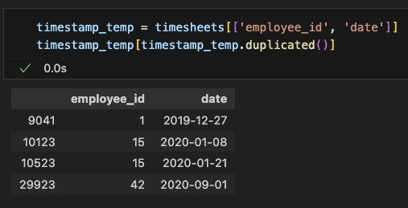
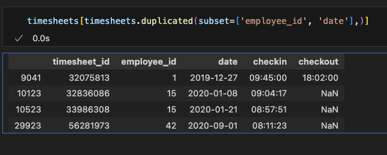
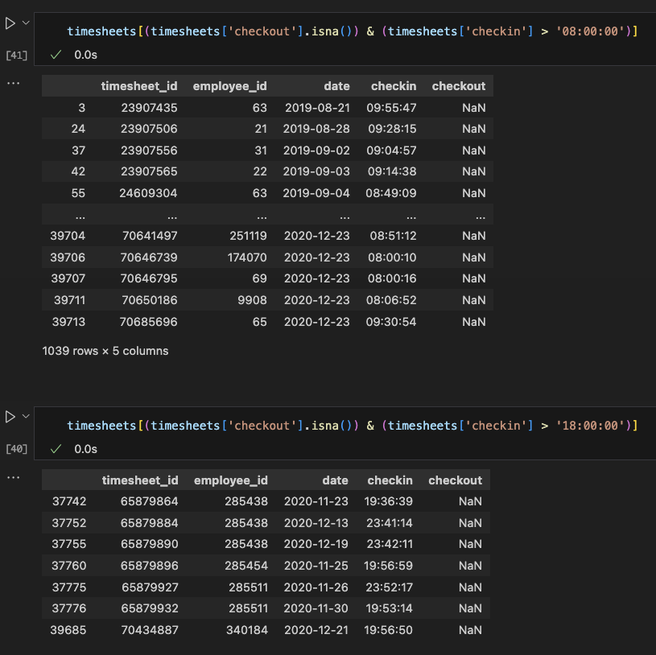
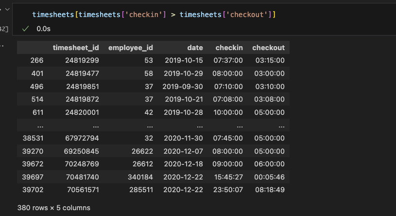

# ETL Branch Salary Pipeline

This repository contains two implementations of an ETL (Extract, Transform, Load) pipeline for processing branch salary data: one in Python (`etl_branch_salary.py`) and another in SQL (`etl_branch_salary.sql`). Both pipelines are designed to create or update a table in BigQuery with aggregated salary data per branch.

## Table of Contents

1. [Python Implementation](#python-implementation)
2. [SQL Implementation](#sql-implementation)
3. [Key Features](#key-features)
4. [Prerequisites](#prerequisites)
5. [Usage](#usage)
6. [Code Structure](#code-structure)
7. [Workflow and Analysis](#workflow-analysis)
8. [Pipeline Optimization](#pipeline-optimization)
8. [Bonus](#bonus)

## Python Implementation

The Python implementation (`etl_branch_salary.py`) uses pandas for data processing and the Google Cloud BigQuery client library for interacting with BigQuery. It follows a modular approach with separate modules for extraction, transformation, and loading operations.

### Key Components:

- `extract_pipeline.py`: Contains functions for loading CSV files.
- `transform_pipeline.py`: Includes functions for data cleaning, transformation, and aggregation.
- `load_pipeline.py`: Handles the upload of processed data to BigQuery.

## SQL Implementation

The SQL implementation (`etl_branch_salary.sql`) is a single SQL script that creates or replaces a table in BigQuery. It performs similar data processing steps as the Python version but using SQL operations.

## Key Features

1. **Correctness**: Both implementations focus on producing correct output by:
   - Removing duplicate timesheet records
   - Handling missing checkin and checkout times
   - Adjusting checkout times when they're earlier than checkin times
   - Aggregating data by year, month, and branch
   - Calculating salary per hour

2. **Readability**:
   - Clear function and variable naming
   - Modular code structure in the Python implementation
   - Comments explaining complex operations
   - Use of CTEs (Common Table Expressions) in the SQL implementation for better readability

3. **Exception Handling**:
   - The Python implementation includes logging and try-except blocks to handle and report errors
   - Invalid data and edge cases (e.g., missing times, incorrect date formats) are handled gracefully

4. **Pipeline Optimization**:
   - The Python implementation is parameterized for easy configuration
   - Both implementations are designed to be idempotent, allowing for safe re-runs
   - The SQL implementation uses clustering for improved query performance


## Prerequisites

- Python 3.7+
- pandas
- google-cloud-bigquery
- python-dotenv
- Access to Google Cloud Platform and BigQuery

## Usage

### Python Implementation

1. Set up your environment variables in a `.env` file:
   ```
   BIGQUERY_PROJECT_ID=your_project_id
   SERVICE_ACCOUNT_PATH=path_to_your_service_account_json
   ```

2. Run the pipeline:
   ```
   python etl_branch_salary.py
   ```

### SQL Implementation

1. Execute the SQL script in your BigQuery environment:
   ```
   bq query --use_legacy_sql=false < etl_branch_salary.sql
   ```

## Code Structure

### Python Implementation

```
.
├── etl_branch_salary.py
├── common_package/
│   ├── extract/
│   │   └── extract_pipeline.py
│   ├── transform/
│   │   └── transform_pipeline.py
│   └── load/
│       └── load_pipeline.py
├── employees.csv
└── timesheets.csv
```

### SQL Implementation

- Single file: `etl_branch_salary.sql`

## Workflow and analysis

### Workflow

#### Python Workflow
Load CSV & Filter by 1 day before &rarr; Remove duplicate values &rarr; Transforming Checkin and Checkout Timestamp
&rarr; Calculate time different &rarr; Join and aggregate two tables &rarr; Load Incremental to Bigquery


### Analysis

Understanding there is data cleaning or transformation in this python, this section is to explain the reason behind it.

1. **Removing Duplicate Value**:
 - There is duplicate value in this raw python data especially on timesheets.csv
    
 - To remove duplicate there is two method i use first check if column checkout with null will be removed, else it will remove the last index
    
2. **Adjusting time**:
 - Fill Null Values, based on their checkin or checkout, this is because from the image below there is person that may working at night or morning
    
 - Adjust checkout time, if checkout time less than checkin (I'm assuming that they overwork until the next day or maybe night shift)
    


## Pipeline Optimization

1. **Parameterization**: The Python implementation uses environment variables and function parameters for easy configuration.
2. **Idempotency**: Both implementations are designed to be safely re-run without duplicating data.
3. **Deterministic Output**: The processing steps ensure consistent output for the same input data.
4. **Performance**: 
   - The SQL implementation uses clustering for improved query performance.
   - The Python implementation uses efficient pandas operations and BigQuery's batch insert capabilities.

For any questions or issues, please open an issue in the repository or contact the maintainer.


## Bonus Project

### Data Migration from BigQuery to Alibaba Cloud ApsaraDB for ClickHouse using Airbyte

I have developed a mini-project demonstrating data migration from Google BigQuery to Alibaba Cloud ApsaraDB for ClickHouse. This project utilizes [Airbyte](https://airbyte.com/), an open-source data integration tool, to facilitate seamless data transfer between these two platforms. Key features include:

- **Source**: Google BigQuery
- **Destination**: Alibaba Cloud ApsaraDB for ClickHouse
- **Tool Used**: Airbyte for ETL operations
- **Use Case**: The project showcases efficient data movement, transformation, and loading from a cloud-based data warehouse to a scalable, high-performance analytical database, addressing real-world data integration challenges.


### Youtube video:
[](https://www.youtube.com/watch?v=CEr3pQliJwE)
